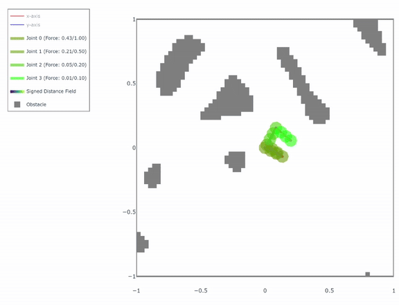

# Constraint-Based Solver for Kino-Dynamic Robot Motion Planning in Voxel Models




## Overview
This repository introduces a constraint-based solver for kino-dynamic robot motion planning in voxel models. This solver:

- Implements a constraint-based optimization framework
- Utilizes Sequential Quadratic Programming (SQP), implementing a variety of flavours 
- Integrates full robot dynamics using the Newton-Euler algorithm
- Operates on voxel-based environmental representations

## Usage

### SQP Solver

The SQP (Sequential Quadratic Programming) solver is the core component of this framework, providing various optimization methods for robot motion planning. The solver is implemented in `sqp_solver.py` and offers a unified interface to different SQP variants.

#### Basic Usage

```python
from chompax.structures import WorldInfo, OptimInfo, RobotInfo
from sqp_solver import SQP
import jax.numpy as jnp

# Initialize problem information
world_info = WorldInfo(...)
optim_info = OptimInfo(...)
robot_info = RobotInfo(...)
sdf = jnp.array(...)  # Signed distance field
x0 = jnp.array(...)   # Initial trajectory

# Create an SQP solver with desired method
solver = SQP(
    method="line_search",  # Choose from available methods
    max_iter=30,
    optim_info=optim_info,
    initial_sigma=10.0,
    initial_hessian_scale=5.0
)

# Solve the optimization problem
result = solver.solve(
    world_info=world_info,
    robot_info=robot_info,
    sdf=sdf,
    x0=x0
)

# For batch processing (multiple initial trajectories)
batch_x0 = jnp.array([...])  # Batch of initial trajectories
batch_results = solver.solve_batch(
    world_info=world_info,
    robot_info=robot_info,
    sdf=sdf,
    x0=batch_x0
)
```

#### Available SQP Methods

The solver supports five different SQP methods, each with its own characteristics:

1. **line_search**: Standard SQP with line search for step size determination and BFGS Hessian approximation
2. **trust_region**: SQP with trust region approach for step size control and BFGS Hessian approximation
3. **vanilla_BFGS**: Basic SQP with BFGS Hessian approximation
4. **vanilla**: Simple SQP implementation without advanced features
5. **line_search_maratos**: Line search SQP with Maratos correction to improve convergence

#### Parameter Configuration

The following table shows the parameters available for each SQP variant:

| Parameter | Description | line_search | trust_region | vanilla_BFGS | vanilla | line_search_maratos |
|-----------|-------------|:-----------:|:------------:|:------------:|:-------:|:------------------:|
| `max_iter` | Maximum number of iterations | ✓ | ✓ | ✓ | ✓ | ✓ |
| `initial_sigma` | Initial penalty parameter for merit function | ✓ | ✓ | - | - | ✓ |
| `initial_trust_radius` | Initial trust region radius | - | ✓ | - | - | - |
| `initial_hessian_scale` | Scale factor for initial Hessian approximation | ✓ | ✓ | ✓ | - | ✓ |


(to run tests look at the README in the help folder)

## Prerequisites
- Access to the rokin repository (private repository)
- Conda or Mamba package manager
- For GPU support: Compatible NVIDIA GPU with appropriate drivers

## Installation

### Dataset Setup
1. Run the dataset download script:
   ```bash
   chmod +x download_dataset.sh
   ./download_dataset.sh
   ```
   
   This script will:
   - Download the required dataset from Google Drive
   - Set the `ROBDATA_PATH` environment variable
   - Add this environment variable to your `~/.bashrc` file

### Option 1: Native Installation

#### GPU Installation
Create a new conda environment with GPU support:
```bash
conda env create -f environment.yml
```

#### CPU Installation
For systems without GPU support:
```bash
conda env create -f environment-cpu.yml
```

### Option 2: Docker Installation (Docker ≥ 23.0)

While native installation is recommended, Docker support is available:

1. **Requirements**:
   - Docker version 23.0 or higher
   - SSH agent running with the private key for Rokin repository access
   - For GPU support: NVIDIA Container Toolkit and access to NVIDIA Container Registry

2. **Configuration**:
   - The Docker setup expects databases in the `data` directory
   - The environment variable `ROBDATA_PATH` is set to `/data` in the docker-compose file
   - You can modify this configuration as needed

3. **Usage**:
   - For a shell environment:
     ```bash
     docker compose run --remove-orphans chompax-[ENV]
     ```
     Replace `[ENV]` with either `cpu` or `gpu` depending on your system.

   - For devcontainer usage:
     Modify the `service` and `runServices` attributes in `.devcontainer/devcontainer.json` to specify either `cpu` or `gpu`.

4. **IDE Integration**:
   Any IDE supporting devcontainers (such as VS Code) can automatically build and deploy a fully functional development environment.

